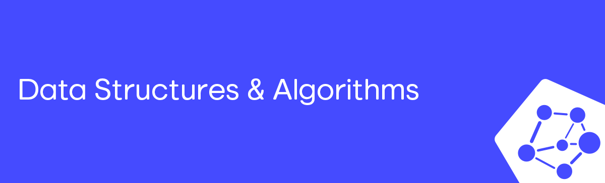

This repository contains various data structures and algorithms commonly used in computer science. Each structure includes its implementation, variations, exercises, and application scenarios. You can find the structure you're looking for in the repository index by clicking the link in the corresponding section.

Most of the algorithms were developed by me, Ícaro. However, feel free to suggest improvements or corrections as you see fit.

<em>If you found my work helpful, please consider giving this repo a ⭐. Thank you!</em>

 
# Index

## Data Structures

### Stack
- [Stack implementations](01.%20Data%20Structures/01.%20Stack/stack_operations)
- [Stack exercises](01.%20Data%20Structures/01.%20Stack/stacks_challenges)

## Algorithms

### Search Algorithms
- [Linear Search](02.%20Algorithms/01.%20Search%20Algorithms/1.%20Linear%20search.c)
- [Binary Search](02.%20Algorithms/01.%20Search%20Algorithms/2.%20Binary%20search.c)
