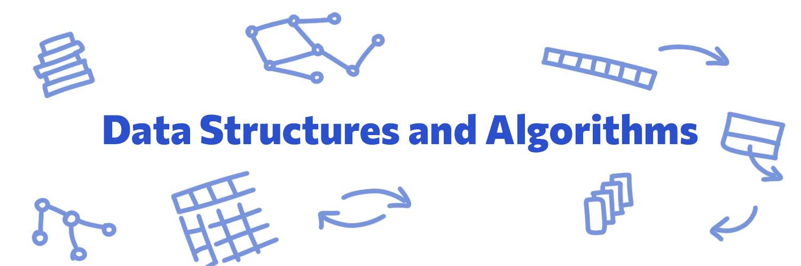

 

This repository contains several data structures and algorithms used in computer science. Every structure has its implementation and variations along with some exercises and application scenarios. Below you can look for the structure you want in the repository index by clicking in the link on the corresponding area.

The most algorithms were created by me, Ícaro. But feel yourself at home to correct or suggest whatever changes you think might be good.

<em>If my work helped you some way, don't forget to ⭐ this repo. Thank you!</em>

 
# Index

## Data Structures

### Stack
- [Stack implementations](01.%20Data%20Structures/01.%20Stack/stack_operations)
- [Stack challenges]()

## Algorithms
